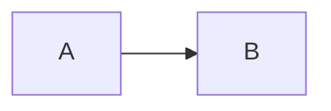

# Everything-Is-A-Markdown (EIAM)

언어: [English](README.md) | **한국어**

Everything-Is-A-Markdown은 로컬 Markdown 볼트를 정적 웹사이트로 빌드해, 폴더/파일 탐색 구조를 유지한 채 공개할 수 있게 해주는 CLI 도구입니다.

## 이 앱은 무엇을 하나요

- Markdown 볼트에서 정적 문서/블로그 사이트를 생성
- `publish: true` 문서만 선택적으로 공개
- 비공개 노트와 공개 콘텐츠 분리

## Obsidian 사용자에게 특히 잘 맞습니다

- Obsidian에서 평소처럼 작성한 뒤, 공개할 문서만 빌드할 수 있습니다.
- Obsidian 스타일 위키링크(`[[...]]`)를 지원합니다.

## 설치

```bash
bun install
```

## 사용 방법

```bash
bun run blog [build|dev|clean] [options]
```

명령:

- `bun run build`: 정적 파일 빌드
- `bun run dev`: 로컬 개발 서버 실행 (기본 `http://localhost:3000`)
- `bun run clean`: `dist`와 `.cache` 삭제

자주 쓰는 옵션:

- `--vault <path>`: Markdown 루트 디렉터리 (기본 `.`)
- `--out <path>`: 출력 디렉터리 (기본 `dist`)
- `--exclude <glob>`: 제외 패턴 추가 (반복 가능)
- `--new-within-days <n>`: NEW 배지 기준 일수 (정수 `>= 0`, 기본 `7`)
- `--recent-limit <n>`: Recent 폴더 문서 수 제한 (정수 `>= 1`, 기본 `5`)
- `--port <n>`: 개발 서버 포트 (기본 `3000`)

## Markdown Lint (publish 전용)

`publish: true` 문서만 대상으로 Markdown lint를 실행하고, 결과를 JSON 파일로 저장할 수 있습니다.
내부적으로 `markdownlint` Node API를 사용합니다.

```bash
bun run lint:md:publish -- --out-dir ./reports
```

엄격 모드(`--strict`)를 추가하면 위반이 있을 때 종료 코드 `1`을 반환합니다.

```bash
bun run lint:md:publish -- --out-dir ./reports --strict
```

옵션:

- `--out-dir <path>`: 리포트 출력 디렉터리 (필수)
- `--strict`: 위반이 있으면 종료 코드 `1`
- `--vault <path>`: Markdown 루트 디렉터리 재지정 (선택)
- `--exclude <glob>`: 제외 패턴 추가 (반복 가능)

## 설정 파일 (`blog.config.ts`)

SEO/UI/정적 파일 설정은 config 파일에서 관리할 수 있습니다.

```ts
const config = {
  vaultDir: "./vault",
  outDir: "./dist",
  staticPaths: ["assets", "public/favicon.ico"],
  seo: {
    siteUrl: "https://example.com",
    pathBase: "/blog",
    defaultOgImage: "/assets/og.png",
  },
  markdown: {
    mermaid: {
      enabled: true,
      cdnUrl: "https://cdn.jsdelivr.net/npm/mermaid@10/dist/mermaid.min.js",
      theme: "default",
    },
  },
};

export default config;
```

`staticPaths`:

- 볼트 기준 상대 경로 배열
- 폴더와 파일 모두 지정 가능
- 지정한 경로의 파일들을 `dist`에 같은 상대 경로로 복사
- 예: 볼트 `assets/og.png` -> `dist/assets/og.png`

`seo.pathBase`:

- 서브패스 배포(예: `/blog`)를 정식 지원합니다.
- 내부 라우팅/본문 fetch 링크에 동일한 base path가 적용됩니다.
- 루트 배포는 빈 문자열(`""`)을 사용합니다.

예시:

```bash
# 샘플 볼트로 실행
bun run dev -- --vault ./test-vault --out ./dist

# 빌드
bun run build -- --vault ./test-vault --out ./dist
```

## Markdown Frontmatter

공개 여부를 결정하는 핵심 필드는 `publish`입니다.

필수:

- `publish: true`  
  이 값이 `true`인 문서만 빌드 결과에 포함됩니다.
- `prefix: "A-01"`  
  문서의 공개 식별자이자 라우트(`/A-01/`) 기준입니다.  
  `publish: true`인데 `prefix`가 없으면 빌드 경고를 출력하고 문서를 제외합니다.

선택:

- `draft: true`  
  `publish: true`여도 문서를 제외합니다.
- `title: "..."`  
  문서 제목. 없으면 파일명을 사용합니다.
- `branch: dev`  
  브랜치 필터 분류값.
- `description: "..."`  
  요약 설명.
- `tags: ["tag1", "tag2"]`  
  문자열 배열.
- `date: "YYYY-MM-DD"` 또는 `createdDate: "..."`  
  생성일.
- `updatedDate: "..."` 또는 `modifiedDate: "..."` 또는 `lastModified: "..."`  
  수정일.

## Frontmatter 예시

게시 문서:

```md
---
publish: true
prefix: "DEV-01"
branch: dev
title: Setup Guide
date: "2024-09-15"
updatedDate: "2024-09-20T09:30:00"
description: How to set up your development environment
tags: ["tutorial", "setup"]
---

# Setup Guide
```

비공개 문서 (제외됨):

```md
---
publish: false
title: Internal Notes
---
```

초안 문서:

```md
---
publish: true
draft: true
title: Work In Progress
---
```

## Mermaid 다이어그램 지원

코드 블록의 언어를 `mermaid`로 작성하면 브라우저에서 Mermaid 다이어그램으로 렌더링합니다.

````md

````

문서 전환 시에도 해당 블록을 다시 렌더링합니다.
Mermaid fence는 일반 코드 블록 UI와 분리된 전용 컨테이너(`.mermaid-block`)에서 렌더링되므로 코드 헤더/파일명/복사 버튼이 표시되지 않습니다.
렌더된 SVG는 데스크톱/모바일 모두에서 중앙 정렬되며 `min(100%, 720px)` 기준으로 자동 축소됩니다.
본문 이미지도 동일한 폭 정책을 적용해 글 읽기 흐름을 유지합니다.
설정에서 Mermaid를 비활성화하거나 CDN 로드가 실패하면, 같은 컨테이너 안에서 소스 코드 텍스트를 유지하고 하단에 경고 메시지를 표시합니다.

`blog.config.ts`에서 설정:

```ts
markdown: {
  mermaid: {
    enabled: true, // false면 코드 블록만 표시
    cdnUrl: "https://cdn.jsdelivr.net/npm/mermaid@10/dist/mermaid.min.js", // http/https 또는 /, ./, ../ 경로
    theme: "default", // mermaid.initialize({ theme }) 값
  },
},
```

유효성 검증 및 런타임 가드레일:

- `markdown.mermaid.cdnUrl`에 잘못된 값(예: `javascript:`)이 들어오면 빌드 시 기본 CDN URL로 자동 폴백합니다.
- `markdown.mermaid.theme`이 유효한 식별자 형식이 아니면 빌드 시 `default`로 자동 폴백합니다.
- 런타임 로더는 실패 후 남은 Mermaid 스크립트를 정리하고, 중복 삽입을 피하며, 다음 렌더에서 재시도합니다.

## bunx 실행 (선택)

```bash
bunx @limcpf/everything-is-a-markdown build --vault ./vault --out ./dist
bunx @limcpf/everything-is-a-markdown dev --port 3000
```

## 라이선스

MIT. `LICENSE` 파일을 참고하세요.
