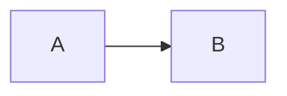

# Everything-Is-A-Markdown (EIAM)

Language: **English** | [한국어](README.ko.md)

Everything-Is-A-Markdown is a CLI tool that turns a local Markdown vault into a static website while keeping the folder/file navigation experience.

## What This App Is For

- Build a static docs/blog site from your Markdown vault
- Publish only documents with `publish: true`
- Keep private notes and public content separate

## Works Great with Obsidian

- You can keep writing in Obsidian and publish selected notes.
- Obsidian-style wikilinks (`[[...]]`) are supported.

## Install

```bash
bun install
```

## Usage

```bash
bun run blog [build|dev|clean] [options]
```

Commands:

- `bun run build`: Build static files
- `bun run dev`: Run local dev server (default `http://localhost:3000`)
- `bun run clean`: Remove `dist` and `.cache`

Common options:

- `--vault <path>`: Markdown root directory (default `.`)
- `--out <path>`: Output directory (default `dist`)
- `--exclude <glob>`: Add exclude pattern (repeatable)
- `--new-within-days <n>`: NEW badge threshold days (integer `>= 0`, default `7`)
- `--recent-limit <n>`: Recent folder item limit (integer `>= 1`, default `5`)
- `--port <n>`: Dev server port (default `3000`)

## Markdown Lint (publish only)

You can run Markdown lint only for `publish: true` documents and save results as a JSON report.
Internally, this command uses the `markdownlint` Node API.

```bash
bun run lint:md:publish -- --out-dir ./reports
```

Add strict mode (`--strict`) to return exit code `1` when violations exist.

```bash
bun run lint:md:publish -- --out-dir ./reports --strict
```

Options:

- `--out-dir <path>`: Report output directory (required)
- `--strict`: Return exit code `1` when violations exist
- `--vault <path>`: Override Markdown root directory (optional)
- `--exclude <glob>`: Add exclude pattern (repeatable)

## Config File (`blog.config.ts`)

Use a config file for SEO/UI/static assets.

```ts
const config = {
  vaultDir: "./vault",
  outDir: "./dist",
  staticPaths: ["assets", "public/favicon.ico"],
  seo: {
    siteUrl: "https://example.com",
    pathBase: "/blog",
    defaultOgImage: "/assets/og.png",
  },
  markdown: {
    mermaid: {
      enabled: true,
      cdnUrl: "https://cdn.jsdelivr.net/npm/mermaid@10/dist/mermaid.min.js",
      theme: "default",
    },
  },
};

export default config;
```

`staticPaths`:

- Array of vault-relative paths
- Supports both folders and files
- Copies all matched files into the same relative location in `dist`
- Example: `assets/og.png` in vault becomes `dist/assets/og.png`

`seo.pathBase`:

- Deploy under a subpath (for example `/blog`)
- Internal routing/content fetch links are generated with this base path
- Keep empty (`""`) for root deployment

Examples:

```bash
# Run with the sample vault
bun run dev -- --vault ./test-vault --out ./dist

# Build
bun run build -- --vault ./test-vault --out ./dist
```

## Markdown Frontmatter

The key field for publishing is `publish`.

Required:

- `publish: true`  
  Only documents with this value are included in build output.
- `prefix: "A-01"`  
  Public identifier for the document route (`/A-01/`).  
  If `publish: true` but `prefix` is missing, the document is skipped with a build warning.

Optional:

- `draft: true`  
  Excludes the document even if `publish: true`.
- `title: "..."`  
  Display title. If missing, file name is used.
- `branch: dev`  
  Branch filter label.
- `description: "..."`  
  Short summary.
- `tags: ["tag1", "tag2"]`  
  String array.
- `date: "YYYY-MM-DD"` or `createdDate: "..."`  
  Created date.
- `updatedDate: "..."` or `modifiedDate: "..."` or `lastModified: "..."`  
  Updated date.

## Frontmatter Examples

Published document:

```md
---
publish: true
prefix: "DEV-01"
branch: dev
title: Setup Guide
date: "2024-09-15"
updatedDate: "2024-09-20T09:30:00"
description: How to set up your development environment
tags: ["tutorial", "setup"]
---

# Setup Guide
```

Private document (excluded):

```md
---
publish: false
title: Internal Notes
---
```

Draft document:

```md
---
publish: true
draft: true
title: Work In Progress
---
```

## Mermaid Diagram Support

This project supports Mermaid diagrams written as fenced code blocks:

````

````

Rendering happens in the browser on first load and when navigating to another document.
Mermaid fences are rendered inside a dedicated diagram container (`.mermaid-block`) instead of the regular code block UI, so they do not show code headers, filenames, or copy buttons.
Rendered SVG output is centered and automatically constrained to `min(100%, 720px)` on both desktop and mobile.
Regular content images inside the viewer follow the same width policy to keep reading flow stable.
If Mermaid is disabled in config or CDN loading fails, the source block is shown as-is in the same container and a warning message appears below it.

Configuration options (`blog.config.ts`):

```ts
markdown: {
  mermaid: {
    enabled: true, // false to keep only source blocks
    cdnUrl: "https://cdn.jsdelivr.net/npm/mermaid@10/dist/mermaid.min.js", // CDN URL (http/https or /, ./, ../)
    theme: "default", // passed to mermaid.initialize({ theme })
  },
},
```

Validation and runtime guardrails:

- Invalid `markdown.mermaid.cdnUrl` values (for example `javascript:`) automatically fall back to the default CDN URL at build time.
- Invalid `markdown.mermaid.theme` values automatically fall back to `default` at build time.
- Runtime loader removes stale Mermaid script tags after failures, avoids duplicate injection, and retries cleanly on the next render.

## bunx (Optional)

```bash
bunx @limcpf/everything-is-a-markdown build --vault ./vault --out ./dist
bunx @limcpf/everything-is-a-markdown dev --port 3000
```

## License

MIT. See `LICENSE`.
