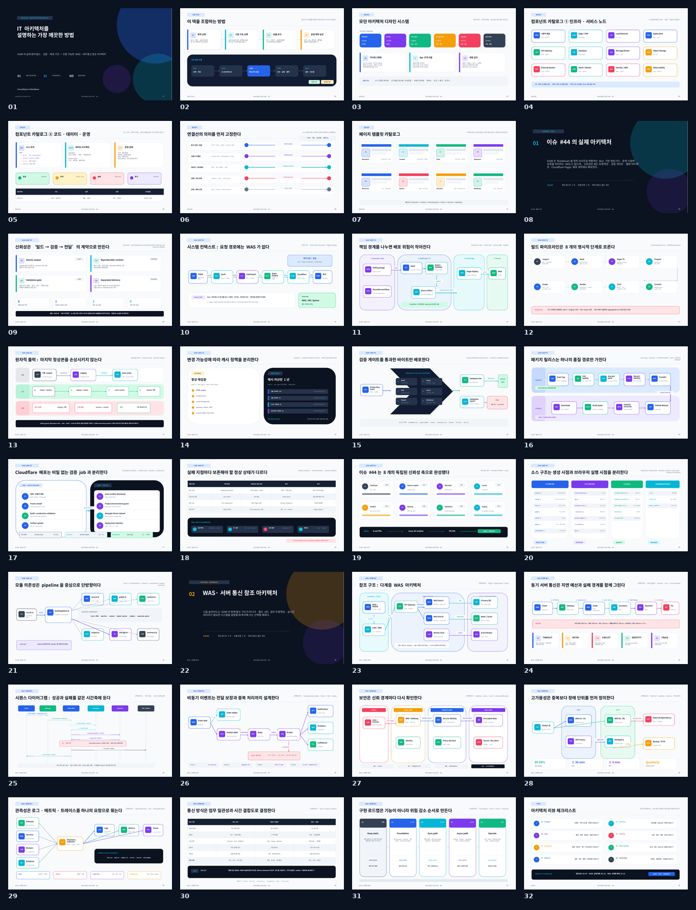
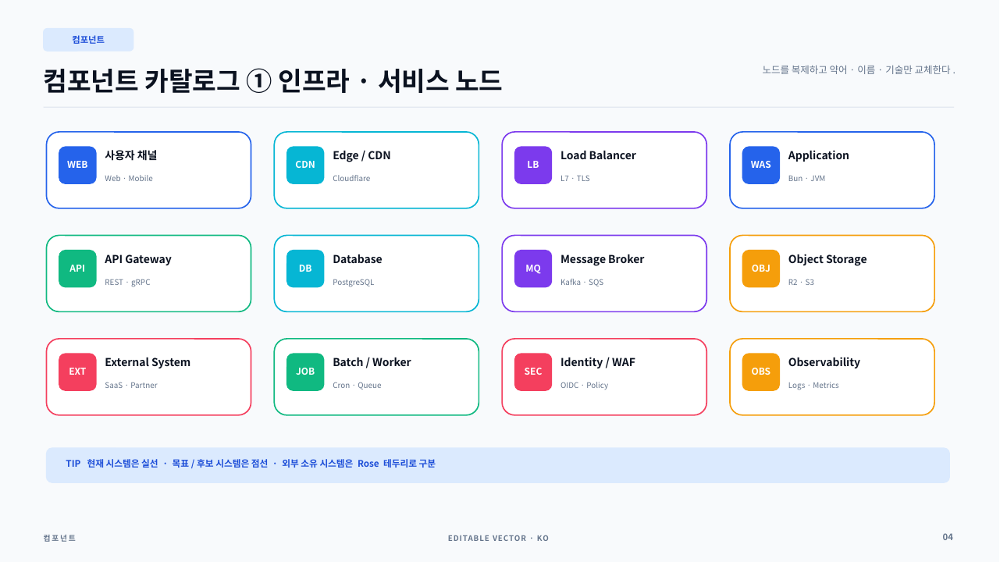
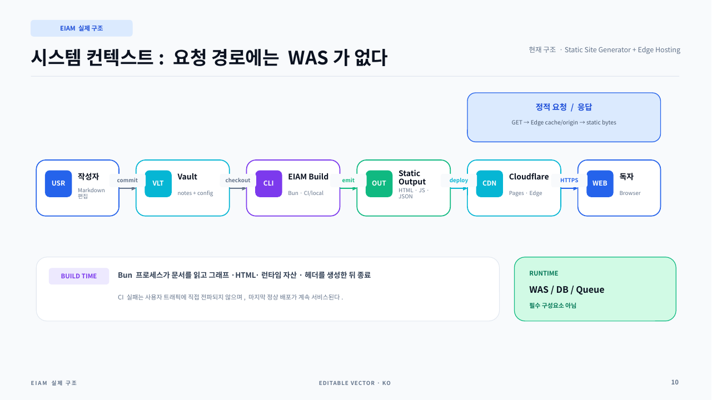
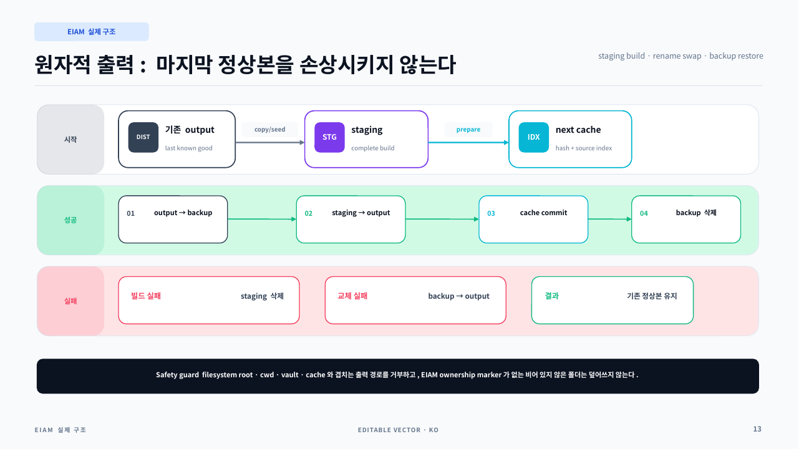
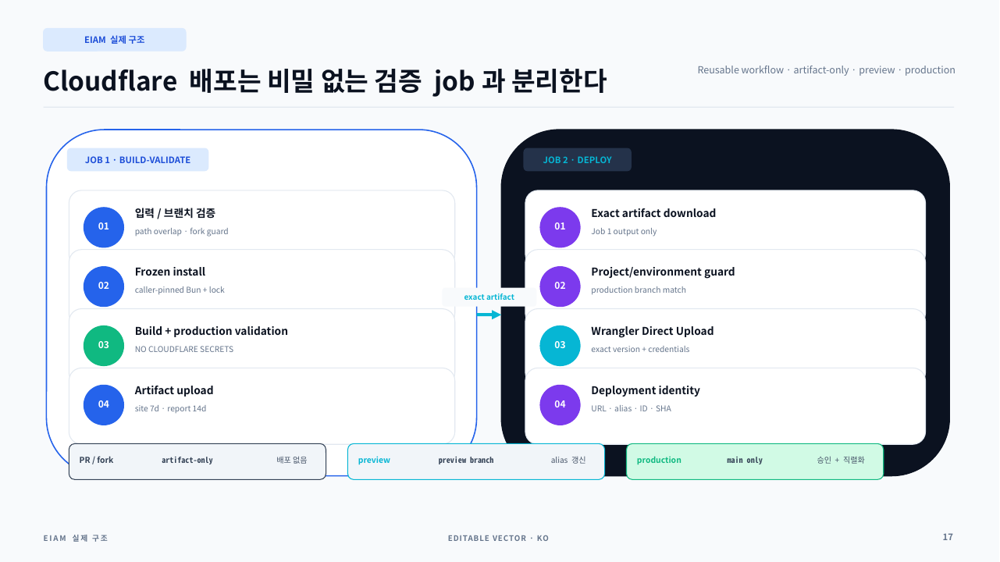
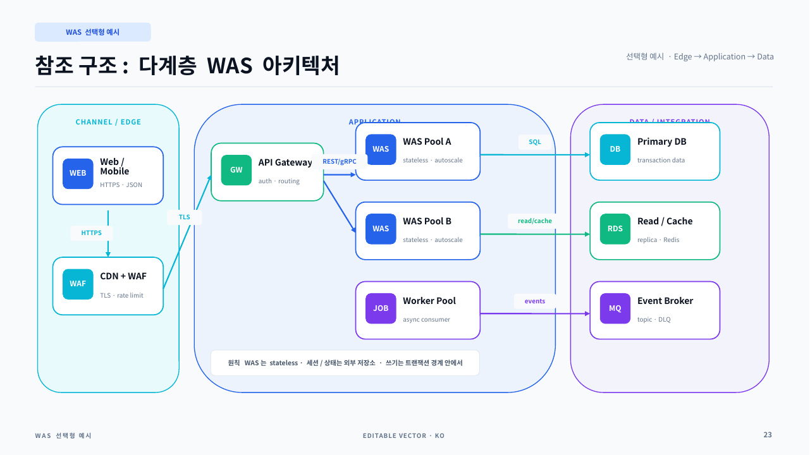
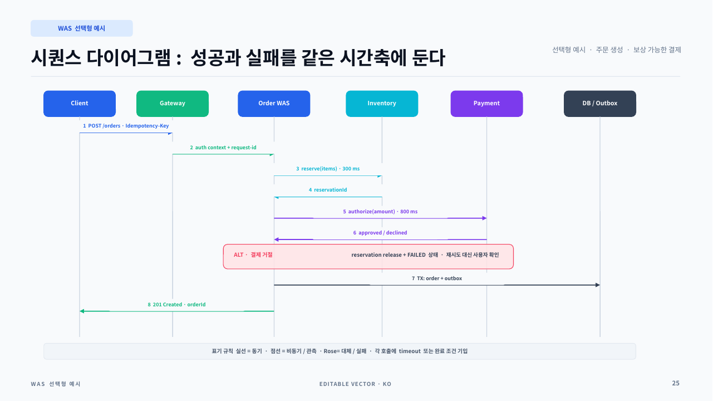
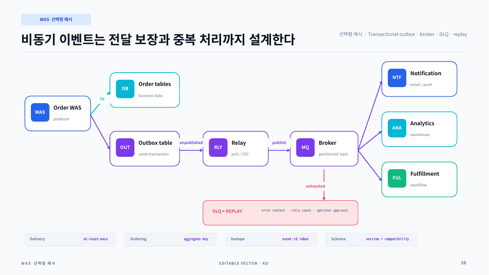
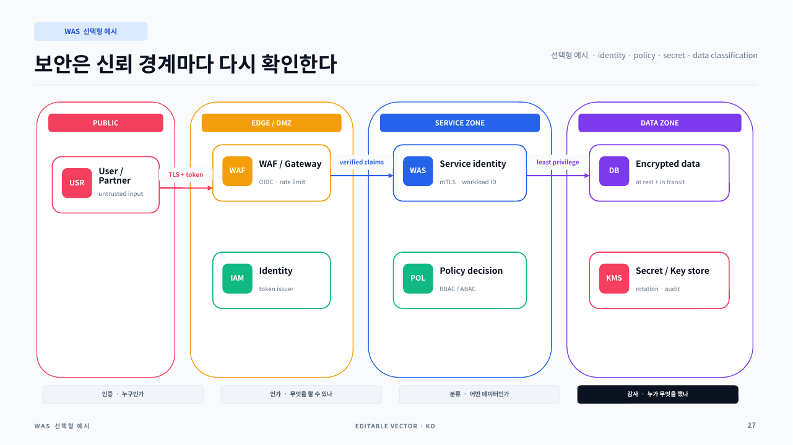
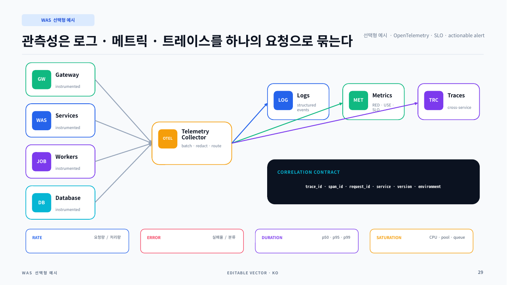

# 이슈 #44 아키텍처 PPT 키트

이 키트는 이슈
[#44](https://github.com/limcpf/Everything-Is-A-Markdown/issues/44)의 실제
EIAM 빌드·검증·배포 구조와, 일반적인 WAS·서버 간 통신을 설명할 때 복사해
쓸 수 있는 참조 아키텍처를 한글 PowerPoint로 제공한다.

- 16:9 와이드, 32페이지
- PowerPoint에서 개별 편집 가능한 도형·텍스트·연결선
- 슬라이드마다 발표 의도와 편집 팁을 담은 speaker notes
- 한글용 `Noto Sans CJK KR` 기본 글꼴
- EIAM의 **현재 구조**와 범용 WAS **선택형 예시**를 명확히 분리
- PPTX 재생성 소스, OOXML 자동 검증, PDF와 PNG 미리보기 포함

## 바로 사용하기

- [편집용 PPTX](dist/eiam-issue-44-architecture-kit-ko.pptx)
- [전체 PDF 미리보기](dist/eiam-issue-44-architecture-kit-ko-preview.pdf)
- [32페이지 구성 manifest](dist/presentation-manifest.json)
- [자동 검증 결과](dist/validation-report.json)
- [산출물 SHA-256](dist/SHA256SUMS)



PowerPoint에서 PPTX를 연 뒤 필요한 페이지를 복제하고 텍스트, 시스템 이름,
프로토콜만 교체한다. 발표 전에 PC에 `Noto Sans CJK KR`이 없으면 설치하거나
PowerPoint의 **홈 > 바꾸기 > 글꼴 바꾸기**로 조직 표준 한글 글꼴을 적용한다.

## 가장 중요한 전제

EIAM은 Bun에서 실행되는 정적 사이트 생성기다.

```text
Markdown Vault
  → EIAM build
  → HTML / JS / CSS / JSON / _headers
  → 검증된 정적 아티팩트
  → Cloudflare Pages
  → Browser
```

운영 요청 경로에서 API, WAS, DB, 메시지 큐는 필수 구성요소가 아니다. 따라서 이
덱은 다음 두 영역을 시각적으로 구분한다.

| 구분              | 슬라이드 | 의미                                                 |
| ----------------- | -------: | ---------------------------------------------------- |
| `EIAM 실제 구조`  |    08–21 | 이슈 #44로 구현되어 `main`에 병합된 현재 구조        |
| `WAS 선택형 예시` |    22–31 | 동적 업무 시스템을 설명할 때 복사하는 범용 참조 예시 |

WAS 예시를 EIAM의 현재 구조처럼 표현하지 않는다. 향후 별도 API가 실제로
도입될 때도 먼저 `현재`, `목표`, `후보` 중 하나로 라벨을 바꾼다.

## 추천 조합

### 7장 경영진·의사결정 보고

`01 → 09 → 10 → 17 → 18 → 30 → 32`

- 왜 필요한지: 09
- 현재 요청·배포 구조: 10, 17
- 실패 시 안전성: 18
- 선택지와 결정: 30
- 검토 항목: 32

### 12장 EIAM 엔지니어링 리뷰

`01 → 09 → 10 → 12 → 13 → 14 → 15 → 16 → 17 → 18 → 20 → 21`

빌드 트랜잭션, 캐시, 프로덕션 검증, 릴리스, 배포 job 경계와 소스 모듈을
순서대로 설명한다.

### 11장 WAS 신규 설계 제안

`01 → 02 → 03 → 04 → 06 → 23 → 24 → 25 → 27 → 28 → 31`

컴포넌트와 연결선 의미를 먼저 합의한 뒤 다계층 구조, 동기 호출, 시퀀스,
보안, HA, 로드맵으로 진행한다.

### 9장 이벤트 기반 통합 설계

`01 → 03 → 04 → 06 → 24 → 26 → 27 → 29 → 30`

동기 API와 비동기 이벤트의 책임을 분리하고 outbox, 중복 처리, DLQ, 관측성과
의사결정을 함께 보여준다.

### 장애·운영 검토

`18 → 25 → 26 → 27 → 28 → 29 → 32`

실패 경로, 보상, 재처리, 보안 경계, RTO/RPO, telemetry와 운영 인수 조건을
집중해서 검토한다.

## 전체 슬라이드 목록

| 번호 | 제목                                                   | 주 용도                               |
| ---: | ------------------------------------------------------ | ------------------------------------- |
|   01 | IT 아키텍처를 설명하는 가장 깨끗한 방법                | 표지                                  |
|   02 | 이 덱을 조합하는 방법                                  | 발표 흐름과 `현재/예시` 구분          |
|   03 | 모던 아키텍처 디자인 시스템                            | 색상·타이포그래피·간격 토큰           |
|   04 | 컴포넌트 카탈로그 ① 인프라·서비스 노드                 | Web, CDN, LB, WAS, API, DB, MQ 등     |
|   05 | 컴포넌트 카탈로그 ② 코드·데이터·운영                   | 소스 트리, 데이터 오브젝트, 상태      |
|   06 | 연결선의 의미를 먼저 고정한다                          | 동기·비동기·데이터·실패·관측 선       |
|   07 | 페이지 템플릿 카탈로그                                 | Executive, Context, Flow, Sequence 등 |
|   08 | 이슈 #44의 실제 아키텍처                               | EIAM 실제 구조 섹션 표지              |
|   09 | 신뢰성은 ‘빌드 → 검증 → 전달’의 계약으로 만든다        | 이슈 #44 요약                         |
|   10 | 시스템 컨텍스트: 요청 경로에는 WAS가 없다              | EIAM 시스템 컨텍스트                  |
|   11 | 책임 경계를 나누면 배포 위험이 작아진다                | Generator/Vault/Cloud/Reader 소유권   |
|   12 | 빌드 파이프라인은 8개의 명시적 단계로 흐른다           | `buildSite` 처리 단계                 |
|   13 | 원자적 출력: 마지막 정상본을 손상시키지 않는다         | staging/swap/backup/abort             |
|   14 | 변경 가능성에 따라 캐시 정책을 분리한다                | `_headers`, hashed assets, Mermaid    |
|   15 | 검증 게이트를 통과한 바이트만 배포한다                 | 프로덕션 validator와 보고서           |
|   16 | 패키지 릴리스는 하나의 품질 경로만 가진다              | exact tag, tarball, SRI/SHA-256       |
|   17 | Cloudflare 배포는 비밀 없는 검증 job과 분리한다        | build-validate/deploy job             |
|   18 | 실패 지점마다 보존해야 할 정상 상태가 다르다           | 실패 격리와 rollback runbook          |
|   19 | 이슈 #44는 8개의 독립된 신뢰성 축으로 완성됐다         | PR #90–#97 작업 지도                  |
|   20 | 소스 구조는 생성 시점과 브라우저 실행 시점을 분리한다  | 디렉터리 책임                         |
|   21 | 모듈 의존성은 pipeline을 중심으로 단방향이다           | 빌드 모듈 의존성                      |
|   22 | WAS·서버 통신 참조 아키텍처                            | 선택형 예시 섹션 표지                 |
|   23 | 참조 구조: 다계층 WAS 아키텍처                         | Edge/Application/Data 3계층           |
|   24 | 동기 서버 통신은 지연 예산과 실패 경계를 함께 그린다   | REST/gRPC timeout budget              |
|   25 | 시퀀스 다이어그램: 성공과 실패를 같은 시간축에 둔다    | 주문·재고·결제·outbox                 |
|   26 | 비동기 이벤트는 전달 보장과 중복 처리까지 설계한다     | outbox, broker, DLQ, replay           |
|   27 | 보안은 신뢰 경계마다 다시 확인한다                     | identity, policy, secret, data        |
|   28 | 고가용성은 중복보다 장애 단위를 먼저 정의한다          | Multi-AZ, RTO/RPO, PITR               |
|   29 | 관측성은 로그·메트릭·트레이스를 하나의 요청으로 묶는다 | OpenTelemetry와 SLO                   |
|   30 | 통신 방식은 업무 일관성과 시간 결합도로 결정한다       | Sync/Async/Batch 비교와 ADR           |
|   31 | 구현 로드맵은 기능이 아니라 위험 감소 순서로 만든다    | 단계별 완료 조건                      |
|   32 | 아키텍처 리뷰 체크리스트                               | 최종 품질·인수 검토                   |

## 대표 페이지 미리보기

### 편집 가능한 인프라 컴포넌트



### EIAM의 실제 시스템 컨텍스트



### 원자적 출력 트랜잭션



### Cloudflare 배포 job 분리



### 선택형 다계층 WAS 구조



### 동기 시퀀스와 실패 경로



### 비동기 이벤트와 DLQ



### 보안·신뢰 경계



### 통합 관측성



## 디자인 시스템

### 화면 규격

| 속성      | 값                    |
| --------- | --------------------- |
| 비율      | 16:9                  |
| 크기      | 13.333 × 7.5 inch     |
| 바깥 여백 | 0.58 inch             |
| 카드 간격 | 0.24–0.32 inch        |
| 제목      | 25–34 pt              |
| 본문      | 9–12 pt               |
| 캡션·메타 | 7–8.5 pt              |
| 기본 글꼴 | Noto Sans CJK KR      |
| 코드 글꼴 | Noto Sans Mono CJK KR |

### 의미 색상

| 색      | Hex       | 의미                     |
| ------- | --------- | ------------------------ |
| Blue    | `#2563EB` | 주 흐름, 애플리케이션    |
| Cyan    | `#06B6D4` | Edge, 데이터 전달, 캐시  |
| Emerald | `#10B981` | 정상, 검증 통과, 승인    |
| Violet  | `#7C3AED` | 비동기, 이벤트, 트랜잭션 |
| Amber   | `#F59E0B` | 주의, 대기, 운영 작업    |
| Rose    | `#F43F5E` | 실패, 외부 위험, 차단    |
| Slate   | `#334155` | 중립 설명, 경계, 계약    |

같은 역할은 같은 색을 유지한다. 색이 부족하면 장식색을 늘리지 말고 배지나
선 라벨을 추가한다.

### 연결선 계약

| 표현         | 의미                 | 라벨에 적을 내용              |
| ------------ | -------------------- | ----------------------------- |
| Blue 실선    | 동기 요청/응답       | 프로토콜, endpoint, timeout   |
| Violet 점선  | 비동기 이벤트        | event, delivery, ordering key |
| Cyan 굵은 선 | 파일·아티팩트·데이터 | 포맷, 검증 상태, 보존         |
| Rose 점선    | 실패·보상·rollback   | 조건, 결과, 재시도 경계       |
| Slate 점선   | 로그·메트릭·정책     | correlation key, owner        |

방향, 선 종류, 라벨 중 하나라도 없으면 통신 계약이 불명확한 것으로 본다.

## 편집 요령

1. 목적에 가까운 완성 페이지를 복제한다.
2. 상단 섹션 배지를 `현재 구조`, `목표 구조`, `선택형 예시` 중 하나로 바꾼다.
3. 노드는 약어, 이름, 기술 메타데이터 순서로 바꾼다.
4. 연결선에는 `동작 + 프로토콜 + 시간/완료 조건`을 적는다.
5. 정상 흐름은 한 방향으로 유지하고 실패·보상 흐름은 Rose로 분리한다.
6. 한 페이지에는 핵심 문장을 하나만 남긴다.
7. 삭제 가능한 컴포넌트부터 지워 정보 밀도를 낮춘다.
8. 발표 직전 slideshow와 PDF에서 줄바꿈을 다시 확인한다.

### 노드 텍스트 예

```text
WAS
Order Service
Bun · stateless
```

### 연결선 텍스트 예

```text
POST /orders · timeout 1.5s
OrderCreated · at-least-once
validated artifact · SHA-256 verified
rollback · restore previous production
```

## 소스와 재생성

이 디렉터리는 독립된 작은 Bun 패키지다. 저장소 루트의 의존성을 변경하지 않는다.

```text
issue-44-architecture/
├── README.md
├── package.json
├── bun.lock
├── src/
│   ├── generate.mjs
│   └── validate.mjs
├── dist/
│   ├── eiam-issue-44-architecture-kit-ko.pptx
│   ├── eiam-issue-44-architecture-kit-ko-preview.pdf
│   ├── presentation-manifest.json
│   └── validation-report.json
└── preview/
    ├── contact-sheet.png
    └── 대표 슬라이드 PNG
```

PPTX를 재생성하고 검증한다.

```bash
cd docs/presentations/issue-44-architecture
bun install --frozen-lockfile
bun run check
```

`bun run check`는 다음을 수행한다.

1. `src/generate.mjs`로 PPTX와 manifest를 생성한다.
2. PPTX ZIP의 CRC32와 OOXML을 읽는다.
3. 32개 슬라이드와 32개 speaker notes를 확인한다.
4. manifest 제목이 각 슬라이드에 존재하는지 확인한다.
5. `TODO`, `TBD`, placeholder가 없는지 확인한다.
6. 도형이 16:9 페이지 경계 안에 있는지 검사한다.
7. 외부 relationship와 raster media가 없는지 검사한다.
8. 한글 글꼴 선언과 섹션별 페이지 합계를 확인한다.

생성 결과는 [validation-report.json](dist/validation-report.json)에 기록된다.

### PDF·PNG 렌더 검증

커밋된 PDF와 PNG는 LibreOffice 26.2.5.2에서 PPTX를 열어 렌더링한 결과다.
로컬에서 다시 확인하려면 LibreOffice와 Poppler를 설치한 뒤 다음처럼 실행한다.

```bash
mkdir -p .render/slides
soffice --headless \
  --convert-to pdf \
  --outdir .render \
  dist/eiam-issue-44-architecture-kit-ko.pptx
pdftoppm -png -r 96 \
  .render/eiam-issue-44-architecture-kit-ko.pdf \
  .render/slides/slide
```

PowerPoint, LibreOffice, Keynote는 글꼴 대체와 줄바꿈이 조금씩 다르다. 최종 발표
환경에서 PDF export까지 확인하는 것을 권장한다.

## 이슈 #44와 소스 매핑

| 설명 페이지        | 실제 구현                                                            |
| ------------------ | -------------------------------------------------------------------- |
| 12 빌드 파이프라인 | `src/build/pipeline.ts`                                              |
| 13 원자적 출력     | `src/build/storage.ts`                                               |
| 14 캐시·Mermaid    | `src/build/cache-headers.ts`, `src/build/output.ts`                  |
| 15 프로덕션 검증   | `scripts/validate-production.ts`, `scripts/production-validation.ts` |
| 16 패키지 릴리스   | `.github/workflows/release.yml`                                      |
| 17 Cloudflare 배포 | `.github/workflows/deploy-cloudflare-pages.yml`                      |
| 18 롤백            | `docs/CLOUDFLARE-PAGES.md`, `docs/RELEASING.md`                      |
| 20–21 소스 구조    | `src/build/*`, `src/runtime/*`, `scripts/*`                          |

이슈 #44의 8개 세부 작업은 PR #90–#97로 `issue-44-mother`에 통합되었고,
최종 PR #98로 `main`에 병합되었다.

## 검증 범위와 제한

- PPTX는 외부 이미지나 네트워크 URL을 참조하지 않는다.
- 모든 핵심 다이어그램은 PowerPoint 도형이므로 색, 크기, 연결선을 수정할 수 있다.
- 글꼴 파일은 PPTX에 임베드하지 않는다. 배포 정책에 맞는 한글 글꼴을 설치한다.
- WAS 슬라이드는 개념 예시다. 실제 용량, SLA, 보안 정책, 제품 제약은 별도로
  검증한다.
- Cloudflare, GitHub Actions, npm의 화면이나 API를 캡처한 자료가 아니라
  이 저장소의 구현 계약을 설명한 도식이다.
- 새로운 구현이 `main`에 들어오면 생성 소스, manifest, PPTX, PDF, PNG를 함께
  갱신한다.
